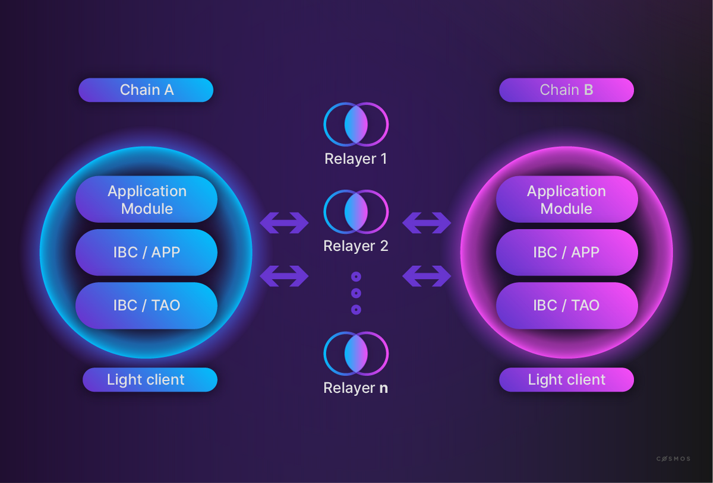

# Pocket Network ↔ IBC

_NOTE: This is a living document and is subject to change, as and when any unidentified hurdles become identified._

<!-- TOC -->
* [Pocket Network IBC Roadmap](#pocket-network-ibc-roadmap)
  * [Inter-Blockchain Communication (IBC) 📱](#inter-blockchain-communication--ibc--📱)
    * [Overview](#overview)
  * [Roadmap](#roadmap)
    * [Specification Implementation - Core](#specification-implementation---core)
      * [Phase 1 🏗️](#phase-1-🏗️)
      * [Phase 2 🏗️](#phase-2-🏗️)
    * [Specification Implementation - Relayer](#specification-implementation---relayer)
      * [Phase 3 🏗️](#phase-3-🏗️)
    * [Specification Implementation - Light Clients](#specification-implementation---light-clients)
      * [Phase 4 🏗️](#phase-4-🏗️)
    * [Specification Implementation - Applications](#specification-implementation---applications)
      * [Phase 5 🏗️](#phase-5-🏗️)
<!-- TOC -->

## Inter-Blockchain Communication (IBC) 📱

IBC is a protocol that allows for the communication of arbitrary data between blockchains in a trustless, and bridgeless manner. This opens the doors for a wide range of possibilities such as cross-chain token transfers, interchain accounts and much much more.

This new level of interoperability for Pocket would allow us to expand into the ever-growing DeFi landscape. There are a number of potential features we could implement after the initial IBC integration, which would revolutionise not only Pocket but the Web3 ecosystem in general. These are still a long way off but require our IBC module to be complete before we can even begin to think about them. 🧠

### Overview

Simply, IBC works by having two Chains **A** and **B** that run light clients of each other on their own chains, in order to verify the other chain’s state. Chain **A** can then signal its intention to send a message to chain **B** by storing a data packet in a block on chain. The IBC relayers (an off-chain process) will periodically query each chain's state for these data packets and relay them to the other chain. Upon chain **B** receiving this data packet, it will use the light client of chain **A** to verify the data was included in the specified block, and if so will act upon this data in an appropriate manner.

## Roadmap

To successfully integrate IBC with Pocket Network we must first break down the extremely large project into smaller tasks with their own goals and deliverables.

### Specification Implementation - Core

#### Phase 1 🏗️

The first phase of the IBC specification implementation aims to get the foundational components, required by all other components of the IBC specification implemented. Upon completion of this phase the rest of the IBC spec, although still a large undertaking, will be ready to be built on top of the work done in phase 1.

**TASK 1 - Implement ICS-23**

The implementation of ICS-23 (Vector Commitments) [1] will enable us to guarantee a state transition has occurred on our chain, allowing other chains to verify this. Without ICS-23 nothing can be done regarding IBC.

**Deliverables**

1. This will require implementing the relevant Data Structures (Protobufs) and the Functions used to interact with them:
    1. As the **manager** of the vector commitment, our chain must be able to add/remove items from the commitment.
    2. This enables the **provers** (generally IBC-Relayers) to generate the inclusion/non-inclusion proofs from the commitment for particular elements, such as transactions.
    3. On another chain the **verifier** will then check these proofs, ensuring the **manager** did or did not add a particular element.
2. Some changes to our consensus module will be needed to enable this to be easily integrated:
    1. Pocket consensus/state updates **MUST** guarantee [finality, safety, liveliness and validity](https://github.com/cosmos/ibc/tree/main/spec/core/ics-002-client-semantics#definitions).
3. Cosmos has implemented a generic merkle proof ICS-23 library [2] which may be able to be used in part or in whole with some modifications to support the [Pocket-specific SMT](https://github.com/pokt-network/smt)
    1. This library [2] already seems to support Celestia’s (_now unmaintained_) SMT library that the `pocket-network/smt` library is forked from [3]

**Goals**

1. Be able to produce state commitment objects that are verifiable following current standards

**TASK 2 - Implement ICS-24**

ICS-24 (Host Requirements) [4] defines the requirements of any IBC-enabled host chain, and the functions they must expose for the relayers and other chains to interact with them successfully.

**Deliverables**

1. Define the functions to retrieve paths and their related keys [5]:
    1. These will be used heavily by the ICS modules dependent on ICS-24.
    2. Much of the code from `ibc-go`'s ICS-24 implementation in [5] could be ported over as it is not `cosmos-sdk` reliant.

**Goals**

1. Be able to retrieve IBC-related paths and keys matching the specific pattern laid out in ICS-24

**TASK 3 - Implement ICS-02**

The implementation of ICS-02 (Client Semantics) [6] involved creating a “light client”, an algorithm to verify state updates from the pocket network, which will allow for the rest of the IBC specification to be built. The ‘light client’ will allow other chains to query the state of the pocket network and verify any transactions that may have taken place:

**Deliverables**

1. A number of Data Structures (Protobufs) and Functions must be implemented according to the specification to allow for the IBC interaction with the clients.
2. When undertaking the ICS-02 implementation, any changes to the consensus module will be easily identifiable. This would be the ideal time to make any desired changes or add any missing features, during the ICS-02 implementation.

**Goals**

1. Build a “light client” that can track consensus on the Pocket Network

**Non-Goals**

1. Build a fully featured “light client” outside the scope of verifying state updates

 

[1] https://github.com/cosmos/ibc/tree/main/spec/core/ics-023-vector-commitments

[2] https://github.com/cosmos/ics23

[3] https://github.com/cosmos/ics23/blob/master/go/proof.go#L46

[4] https://github.com/cosmos/ibc/tree/main/spec/core/ics-024-host-requirements

[5] https://github.com/cosmos/ibc-go/tree/main/modules/core/24-host

[6] https://github.com/cosmos/ibc/tree/main/spec/core/ics-002-client-semantics

 

#### Phase 2 🏗️

The second phase of the IBC implementation aims to complete all the core components of the spec itself [1], leaving us with an IBC module that is ready to have features built-in (interchain accounts, and fungible token transfers for example). This phase, once completed, will also allow us to begin working on integrating Pocket Network with other chains (provided they have also implemented IBC).

**TASK 1 - Implement ICS-03**

The implementation of ICS-03 (Connection Semantics) [2] defines the authorisation aspect of the IBC specification. The connection objects defined in this implementation will enable 2 chains to safely establish a connection which will then allow for cross-chain communication.

**Deliverables**

1. A number of Data Structures (Protobufs) and Functions must be implemented according to the specification to allow for IBC connections to be established and authorised between 2 chains
    1. This implementation only covers the establishing of connections, no actual communication can be done at this point without having implemented ICS-04 and ICS-05

**Goals**

1. Enable the establishment of connections to be done in accordance with the ICS-03 specification

**TASK 2 - Implement ICS-05**

The implementation of ICS-05 (Port Allocation) [3] allows for the binding of uniquely named ports in a connection to allow for channels to be opened for communication.

**Deliverables**

1. A number of Data Structures (Protobufs) and Functions must be implemented according to the specification to allow for IBC port allocation, binding and ownership as well as the transfer or releasing of bound ports
    1. Much like how conventional ports have specific “meanings” (80 for HTTP, 22 for SSH) IBC ports are named and are uniquely identifiable by their names
    2. Multiple channels can utilise a port, as each channel is end-to-end encrypted, provided the port has been bound to the corresponding connection beforehand

**Goals**

1. Allow for ports to be bound with their unique names according to ICS-05
2. Integrating the port naming with ICS-24

**TASK 3 - Implement ICS-04**

The implementation of ICS-04 (Channel and Packet Semantics) [4] focuses on the definition of channels that allow for packets to be passed between one chain and another.

**Deliverables**

1. A number of Data Structures (Protobufs) and Functions must be implemented according to the specification to allow for IBC packets to be received and acknowledge from IBC relayers
2. Channels must provide the following properties: [efficient, exactly once delivered, ordered (with or without timeouts or not ordered at all) and permissible](https://github.com/cosmos/ibc/blob/main/spec/core/ics-004-channel-and-packet-semantics/README.md#desired-properties)
3. Channels must be associated with a particular connection, but connections may have a number of channels associated with them
    1. This allows for the use of common identifiers and reduces the cost of header verification across all channels utilising a single connection and light-client

**Goals**

1. Allow for channels to be created and managed within a connection for the port they are intended for in accordance with the ICS-04 specification

**Non-Goals**

1. IBC packets are payload-agnostic and it is outside of the scope specification itself to determine how Pocket Network should react to the data within a packet

**TASK 4 - Implement an IBC Interface**

The implementation of an interface to interact with the different components of the Pocket Network IBC module. This interface will expose all the functions necessary to do any IBC-related task and as such will be the means by which we create and manage clients, connections, ports and channels.

**Deliverables**

1. Implement an IBC handler interface to allow for a more Pocket-specific way of interfacing with the IBC module.
    1. This would be what is used to interact with the different parts of the IBC module this includes the creation and management of “light clients”, connections, channels and packets.

**Goals**

1. Expose an interface to interact with the different IBC components, as part of the Pocket IBC module

 

[1] https://github.com/cosmos/ibc#core

[2] https://github.com/cosmos/ibc/blob/main/spec/core/ics-003-connection-semantics/README.md

[3] https://github.com/cosmos/ibc/blob/main/spec/core/ics-005-port-allocation/README.md

[4] https://github.com/cosmos/ibc/blob/main/spec/core/ics-004-channel-and-packet-semantics/README.md

 

### Specification Implementation - Relayer

#### Phase 3 🏗️

The third phase of the IBC specification implementation focuses on the creation of an IBC relayer that will allow for the actual communication of IBC packets to and from the Pocket Network. With the implementation of a relayer, we can now begin to focus on the applications of IBC.

**TASK 1 - Implement ICS-18**

The implementation of ICS-18 (Relayer Algorithms) [1] will allow for the relayer to scan the state of each chain, construct the appropriate data packets and relay them to the opposite chain to be executed. Relayers are off-chain processes that can query chain states in order to preform the necessary relays.

**NOTE**: The IBC module will record the data it wants to send to another chain in a block which will then be detected by the relayer and delivered to the other chain. The light client on this chain will verify this data was included in the appropriate block and then execute the appropriate methods.

**Deliverables**

1. A number of Data Structures (Protobufs) and Functions must be implemented according to the ICS-18 specification, to allow for the correct relaying of data packets between chains.
    1. Relayers must meet the following properties: [exactly-once or deliver-or-timeout safety properties for packet relays; liveness; permissionless, all verification must be on chain; minimal communication between the user and relayer; incentives must be possible](https://github.com/cosmos/ibc/blob/main/spec/relayer/ics-018-relayer-algorithms/README.md#desired-properties)
    2. Although we cannot use it directly we will be able to use much of `cosmos/relayer` [2] or even fork it to fit our purposes

**Goals**

1. Have an off-chain process to service IBC relays between IBC-enabled chains with the desired properties

 

[1] https://github.com/cosmos/ibc/blob/main/spec/relayer/ics-018-relayer-algorithms/README.md

[2] https://github.com/cosmos/relayer

 

### Specification Implementation - Light Clients

For the IBC module to be of any use we need our own “light client” made in phase 1 to be run on another chain and also we must run a “light client” that can verify their state on our chain as well.

The resources needed to run these light clients will be fractions of those needed to run a full chain in terms of storage and memory and as such should be able to be run alongside any pocket nodes and chains with ease and minimal impact.

#### Phase 4 🏗️

The fourth phase of the IBC implementation allows for Pocket Network to track the consensus of tendermint (now `comet-bft`) which allows for the communication of IBC packets between cosmos/tendermint chains and Pocket.

**TASK 1 - Implement ICS-07**

The implementation of ICS-07 (Tendermint Client) [1] will allow for the Pocket Network to verify the inclusion of IBC-related data in blocks of the corresponding tendermint chains.

**NOTE**: For the cosmos ecosystem we need only to implement ICS-07, and then spin up different instances of this client for each chain we wish to interact with.

**Deliverables**

1. A number of Data Structures (Protobufs) and Functions must be implemented in accordance with not only ICS-07 but also the `comet-bft` consensus specification [2] and the `comet-bft` light client specification [3]
    1. Implementations already exist for ICS-07 and can be referenced accordingly, `ibc-go` [4], `ibc-rs` [5], and `tendermint-sol` [6]

 

[1] https://github.com/cosmos/ibc/blob/main/spec/client/ics-007-tendermint-client/README.md

[2] https://github.com/cometbft/cometbft/blob/main/spec/consensus/consensus.md

[3] https://github.com/cometbft/cometbft/tree/main/spec/light-client

[4] https://github.com/cosmos/ibc-go/tree/main/modules/light-clients/07-tendermint

[5] https://github.com/cosmos/ibc-rs/tree/main/crates/ibc/src/clients/ics07_tendermint

[6] [https://github.com/ChorusOne/tendermint-sol](https://github.com/ChorusOne/tendermint-sol)

 

### Specification Implementation - Applications

#### Phase 5 🏗️

The fifth phase of the IBC specification implementation brings the use cases of IBC to Pocket Network. With the core of the IBC specification implemented in phases 1 and 2, as well as the relayer and light client implementation, we are now ready to bring the first utility of IBC to Pocket.

**TASK 1 - Implement ICS-20**

The implementation of ICS-20 (Fungible Token Transfer) [1] will allow for the transfer of fungible tokens between two IBC-enabled chains 🚀

**Deliverables**

1. A number of Data Structures (Protobufs) and Functions must be implemented according to the specification to allow for the transfer of fungible tokens between two chains via IBC packets
2. Fungible Token Transfers must have the following properties: [preserving asset fungibility, preserving asset ownership, limiting the impact of Byzantine faults, and requiring no additional permissions](https://github.com/cosmos/ibc/blob/main/spec/app/ics-020-fungible-token-transfer/README.md#desired-properties).

**Goals**

1. Fully integrate ICS-20 with the Handler Interface and Routing Module components of the Pocket IBC module, to allow for cross-chain token transfers to and from the Pocket Network

This phase enters Pocket into the IBC ecosystem in full. After this, any additional implementations such as ICS-27 (Interchain Accounts) [2] can be considered.

 

[1] https://github.com/cosmos/ibc/blob/main/spec/app/ics-020-fungible-token-transfer/README.md

[2] https://github.com/cosmos/ibc/blob/main/spec/app/ics-027-interchain-accounts/README.md
