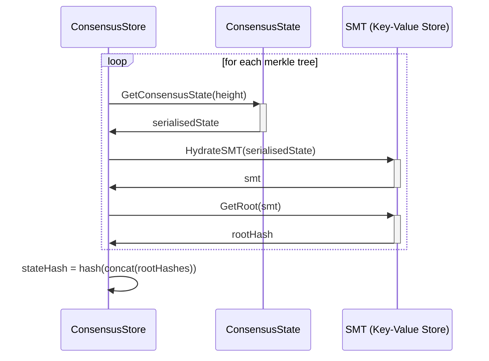
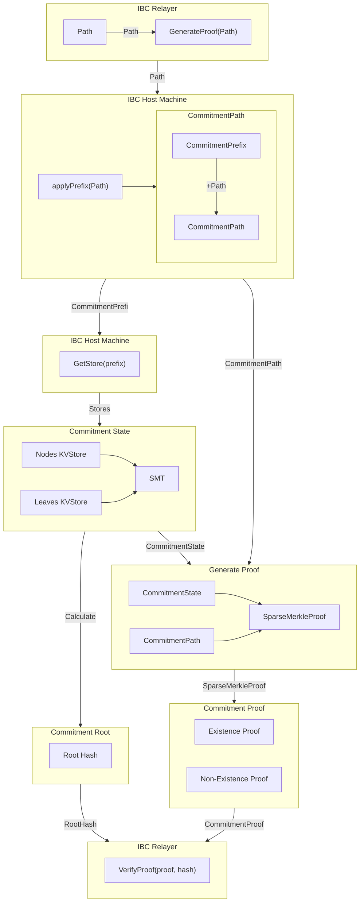

# **ICS-23** (Vector Commitments) <!-- omit in toc -->

**NOTE**: This document is a work-in-progress living documest and, as such, may change over time, when issues are identified or new learnings are made.

- [Overview](#overview)
- [Definitions](#definitions)
  - [CommitmentState](#commitmentstate)
  - [CommitmentRoot](#commitmentroot)
  - [CommitmentPath](#commitmentpath)
  - [CommitmentPrefix](#commitmentprefix)
  - [CommitmentProof](#commitmentproof)
  - [Commitment Types Diagram](#commitment-types-diagram)
- [Types \& Functions](#types--functions)
- [Generating a Proofs](#generating-a-proofs)
  - [Sparse Merkle Proof](#sparse-merkle-proof)
- [Implementation](#implementation)
  - [Initialisation](#initialisation)
  - [Creating Proofs](#creating-proofs)
- [Trees \& Paths](#trees--paths)
- [References](#references)

## Overview

ICS-23 [1] entails the types, and functions, that enable the verification of the state of the network. This means that once implemented we can generate `CommitmentState` and `CommitmentRoot` objects of constant size that can be used to generate `CommitmentProof` objects that represent the membership (or non-membership) of element(s) in the `CommitmentState`.

## Definitions

### CommitmentState

The `CommitmentState` is an object that contains the full state of the commitment, stored by the `manager` (the Pocket Network nodes). This means, in practice, that this is the underlying data structure that we use to store our state.

For Pocket Network this will most likely be a wrapper around the `pokt-network/smt` library. In turn this means that for the `consensusState` that IBC defines (see [ICS-24](../ics24/ics24.md)), the `ConsensusState` object will be a copy/reference of the 7 merkle trees (accounts, transactions, params etc.) that is used to generate the state hash at any given height.

### CommitmentRoot

The `CommitmentRoot` is the root hash of the `CommitmentState` object. By utilising the `pokt-network/smt` library as the underlying data structure for the `CommitmentState` object this can easily be calculated with the following function:

```go
func (*SMT) Root() []byte
```

In the case of the `consensusState` specifically this will require the different subtrees to be accessable outside of `persistence`. This could be done by utilising some sort of export as done by the savepoint functionality. The different state tree's orders will then have to be known outside of `persistence` as well so that the SMT's at any given height can be rehydrated hashed and concatenated in the correct order to properly reproduce the root hash.

How the overall state hash is calculated, can be seen in the following diagram at a high level. A more detail explanation can be found in the [Persistence Documentation](https://github.com/pokt-network/pocket/blob/main/persistence/docs/PROTOCOL_STATE_HASH.md#compute-state-hash), however it is noted that the PostgreSQL database will not be used for this process, only the underlying KVStores of the consensus state's SMT are used.



### CommitmentPath

The `CommitmentPath` is the path used to verify a `CommitmentProof`. This is essentially the bytestring that is used to query the underlying KVStore of the `CommitmentState` and compare the value that it stores against whatever is trying to be proved. These paths have certain restrictions and are defined in [ICS-24](../ics24/ics24.md)

The `CommitmentPath` does not need to be serlialisable but can be a list of tree nodes for example, it must simply provide the path needed to traverse the `CommitmentState` and return the value at the given `CommitmentPath`

### CommitmentPrefix

The `CommitmentPrefix` is the bytestring prefix that is used to identify the individual store within the `CommitmentState` to correctly verify a proof. These are used with the `CommitmentPath`, with the following function:

```go
type Path string
func applyPrefix(prefix CommitmentPrefix, path Path) CommitmentPath
func removePrefix(prefix CommitmentPrefix, path CommitmentPath) Path
```

### CommitmentProof

The `CommitmentProof` is the object generated by the `prover` (i.e IBC Relayers) and verified by the `verifier` actors (i.e. the Counter Party Chain's IBC Module). This object is used to verify membership or non-membership of an element or group of elements in the `CommitmentState` and is verifiable in conjunction with the `CommitmentRoot`.

The `CommitmentProof` can be calculated with the `pokt-network/smt` library's function:

```go
func (*SMT) Prove(key []byte) SparseMerkleProof
```

### Commitment Types Diagram

This diagram documents the process in which a commitment proof is generated ready to verify upon request from an IBC relayer. This flow is triggered upon the receipt of an IBC packet asking for a proof that something has been included in the host machine's state, and asks for a proof to be generated for the counterparty to verify.



## Types & Functions

ICS-23 requires many type definitions, however there is a framework agnostic implementation of ICS-23 in Go [2] which we can import and use within our codebase. This library defines the following types:

**Relating to proofs** [3][4][5]:

```go
type HashOp
type LengthOp
type LeafOp
type ExistenceProof
type NonExistenceProof
type CommitmentProof
type InnerSpec
type ProofSpec
type BatchEntry
type BatchProof
type CompressedBatchEntry
type CompressedBatchProof
type CompressedExistenceProof
type CompressedNonExistenceProof

func (*CommitmentProof) Calculate() CommitmentRoot
func (*ExistenceProof) Calculate() CommitmentRoot
func (*NonExistenceProof) Calculate() CommitmentRoot
func (*ProofSpec) Equals(spec *ProofSpec) bool
func (*ExistenceProof) Verify(spec *ProofSpec, root CommitmentRoot, key, value []byte) error
func (*NonExistenceProof) Verify(spec *ProofSpec, root CommitmentRoot, key []byte) error

func VerifyMembership(spec *ProofSpec, root CommitmentRoot, proof *CommitmentProof, key []byte, value []byte) bool
func VerifyNonMembership(spec *ProofSpec, root CommitmentRoot, proof *CommitmentProof, key []byte) bool
func BatchVerifyMembership(spec *ProofSpec, root CommitmentRoot, proof *CommitmentProof, items map[string][]byte) bool
func BatchVerifyNonMembership(spec *ProofSpec, root CommitmentRoot, proof *CommitmentProof, keys [][]byte) bool
func CombineProofs(proofs []*CommitmentProof) (*CommitmentProof, error)
```

These types and functions allow for the verification of generated proofs and the efficient compression and batching of said proofs. By utilising the `cosmos/ics23` library we will be able to leverage their support for Celestia's SMT [6] and thus use the functions they define to efficiently carry out the verification of the proofs that we generate.

## Generating a Proofs

We use our fork of Celestia's SMT [7] which has the following functions [8]:

```go
func (*SparseMerkleTree) Prove(key []byte) SparseMerkleProof
func (*SparseMerkleTree) ProveCompact(key []byte) SparseCompactMerkleProof
```

These allow us to generate `SparseMerkleProof` types (or their compressed variants for space) for the root of the tree they are operated on. If the leaf may be updated it is advised to use the following instead:

```go
func (*SparseMerkleTree) ProveUpdatable(key []byte) SparseMerkleProof
```

Which generates a proof that can be updated, as and when the leaf node is.

### Sparse Merkle Proof

The `SparseMerkleProof` object has the following structure [9]:

```go
type SparseMerkleProof struct {
	// SideNodes is an array of the sibling nodes leading up to the leaf of the proof.
	SideNodes [][]byte

	// NonMembershipLeafData is the data of the unrelated leaf at the position
	// of the key being proven, in the case of a non-membership proof. For
	// membership proofs, is nil.
	NonMembershipLeafData []byte

	// SiblingData is the data of the sibling node to the leaf being proven,
	// required for updatable proofs. For unupdatable proofs, is nil.
	SiblingData []byte
}
```

## Implementation

To complete the implementation of ICS-23 we must implement the following types and functions:

```go
type Path string
type Value []byte
func GenerateCommitmentState(map[Path]Value) *CommitmentState
func (*CommitmentState) Set(Path, Value) *CommitmentState
func (*CommitmentState) Remove(Path) *CommitmentState
func (*CommitmentState) CreateMembershipProof(Path, Value) *CommitmentProof
func (*CommitmentState) CreateNonMembershipProof(Path) *CommitmentProof
```

Here we can create the `CommitmentState` type to be an interface that wraps the functionality of the `pokt-network/smt` package and exposes the desired functions. In our situation the `Path` which we store our values under should either be:

1. Prefixed with a store key
2. Or we should have an subtree structure as we currently do in `persistence/state.go` - this would presumably still require some sort of Path prefix to determine the subtree

_NOTE:_ This can be decided on the implementation of ICS-24 (Host Requirements) [10] which defines the methods to retrieve the `Path` strings for elements stored in our different state tracking objects.

These trees are to verify not only our current state but also relating to IBC specific key-value pairs that must be stored (relating to the clients, channels, connections, ports, etc.). Our IBC module will require many trees and each of these need to be able to provide verification of (non-)membership of any element.

### Initialisation

The `GenerateCommitmentState()` function takes a map of `Path`, `Value` pairs and initialises the underlying tree with said values, returning the `CommitmentState` that it creates.

### Creating Proofs

The two functions needed to create our `CommitmentProof` objects need to convert the `SparseMerkleProof` objects created from the SMT library's API into the `CommitmentProof` protobuf message type defined in `cosmos/ics23`.

This Protobuf message has the following structure:

```protobuf
message CommitmentProof {
  oneof proof {
    ExistenceProof       exist      = 1;
    NonExistenceProof    nonexist   = 2;
    BatchProof           batch      = 3;
    CompressedBatchProof compressed = 4;
  }
}

message LeafOp {
  HashOp   hash          = 1;
  HashOp   prehash_key   = 2;
  HashOp   prehash_value = 3;
  LengthOp length        = 4;
  bytes prefix = 5;
}

message InnerOp {
  HashOp hash   = 1;
  bytes  prefix = 2;
  bytes  suffix = 3;
}

message ExistenceProof {
  bytes            key   = 1;
  bytes            value = 2;
  LeafOp           leaf  = 3;
  repeated InnerOp path  = 4;
}

message NonExistenceProof {
  bytes          key   = 1;
  ExistenceProof left  = 2;
  ExistenceProof right = 3;
}

message BatchEntry {
  oneof proof {
    ExistenceProof    exist    = 1;
    NonExistenceProof nonexist = 2;
  }
}

message BatchProof {
  repeated BatchEntry entries = 1;
}

message CompressedBatchProof {
  repeated CompressedBatchEntry entries       = 1;
  repeated InnerOp              lookup_inners = 2;
}
```

For our use case the definition of the `SmtSpec` (`ProofSpec`) type defines the `LeafOp` for us:

```go
// SmtSpec constrains the format for SMT proofs (as implemented by github.com/celestiaorg/smt)
var SmtSpec = &ProofSpec{
	LeafSpec: &LeafOp{
		Hash:         HashOp_SHA256,
		PrehashKey:   HashOp_SHA256,
		PrehashValue: HashOp_SHA256,
		Length:       LengthOp_NO_PREFIX,
		Prefix:       []byte{0},
	},
	InnerSpec: &InnerSpec{
		ChildOrder:      []int32{0, 1},
		ChildSize:       32,
		MinPrefixLength: 1,
		MaxPrefixLength: 1,
		EmptyChild:      make([]byte, 32),
		Hash:            HashOp_SHA256,
	},
	MaxDepth:                   256,
	PrehashKeyBeforeComparison: true,
}
```

We should be able to utilise the `SiblingNodes` field of the `SparseMerkleProof` to populate the `Path` field in the `ExistenceProof` object and thus with the `CommitmentProof` type now created we can utilise the functions exposed by `cosmos/ics23` to correctly verify, batch and compress any proofs we create.

## Trees & Paths

As previously mentioned as a part of the IBC we will need to maintain multiple stores. We will have to track the consensus state, client state, connection state, channels, etc. We will be able to utilise the current subtree structure in `persistence/state.go` for our current consensus state with minimal changes (potentially just exporting different tree maps). The implementation of [ICS-24](../ics24/ics24.md) clarifies this in code, as it exposes the methods to retrieve the paths where we will look for different key-value pairs from the different trees. It also defines how we maintain the different KVStores that IBC will utilise to keep track of its state.

The goal of ICS-23 is simply to be able to generate the relevant structures so as to verify the inclusion or absence of any element in a given `CommitmentState` - which we will define as a wrapper for an SMT tree. As such it is not important where those trees are, or how they are used, in order for this ICS to be successfully implemented.

## References

[1] https://github.com/cosmos/ibc/tree/main/spec/core/ics-023-vector-commitments

[2] https://github.com/cosmos/ics23

[3] https://github.com/cosmos/ics23/blob/master/proto/cosmos/ics23/v1/proofs.proto

[4] https://github.com/cosmos/ics23/blob/master/go/proof.go

[5] https://github.com/cosmos/ics23/blob/master/go/ics23.go

[6] https://github.com/cosmos/ics23/blob/master/go/proof.go#L46

[7] https://github.com/pocket-network/smt

[8] https://pkg.go.dev/github.com/pokt-network/smt@v0.4.0#SparseMerkleTree

[9] https://pkg.go.dev/github.com/pokt-network/smt@v0.4.0#SparseMerkleProof

[10] https://github.com/cosmos/ibc/tree/main/spec/core/ics-024-host-requirements
