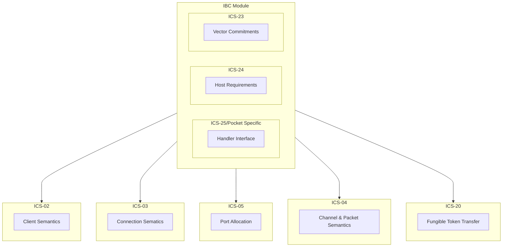

# **ICS-25** (Host Requirements) <!-- omit in toc -->

**NOTE**: This document is still a work in progress and as such may change over time, as and when any issues are identified.

- [Overview](#overview)
- [Module Structure](#module-structure)
- [Paths, Identifiers and Separators](#paths-identifiers-and-separators)
  - [**Identifiers**](#identifiers)
    - [**Lengths**](#lengths)
  - [**Paths**](#paths)
  - [**Separators**](#separators)
- [Key-Value Store](#key-value-store)
  - [**Provable Store**](#provable-store)
  - [**Private Store**](#private-store)
  - [**Backend Store**](#backend-store)
    - [**Changes**](#changes)
- [Path Space](#path-space)
- [References](#references)

## Overview

ICS-24 [1] defines the interfaces, types and other requirements that the IBC module must expose to each of the sub-modules. This specification details the structures and patterns that must be implemented for the rest of the ICS core modules to be implemented successfully. Once this has been implemented the rest of the ICS core modules begin to be implemented in the correct order.

## Module Structure

The IBC module in V1 of the Pocket Network protocol must have a sub-module system, wherein each of the different aspects of the IBC module are implemented as sub-modules within the main IBC module. The specification details support for "untrusted" modules, however this is not necissary for our implementation. As we will be writing our modules ourselves, or vetting those that we decide to use (if any) we can follow the same pattern laid out in the implementation of `ibc-rs` [2] where they also do not support untrusted modules: but instead they assume all modules to be fully trusted.

In practice this will mean we have the following module structure:



## Paths, Identifiers and Separators

Paths, identifiers and separators are used to store, and retrieve and remove items from the key-value store defined below. They must follow certain rules.

### **Identifiers**

An `Identifier` is a bytestring used as the key for an object stored in the state, such as: a connection, a channel or a light-client.

Rules:

- They **must** be non-empty (of positive integer length)
- They must include only the following character sets
  - Alphanumeric
  - `.`, `_`, `+`, `-`, `#`
  - `[`, `]`, `<`, `>`

It is important to note that identifiers are not valuable and as such we should use a pseudo-random method to generate unique identifiers of constant length:

```go
const (
    identifierCharset = "abcdefghijklmnopqrstuvwxyzABCDEFGHIJKLMNOPQRSTUVWXYZ0123456789._+-#[]<>"
    identifierLength = 32
)

func stringWithCharset(length int, charset string) string {
    r := rand.New(rand.NewSource(time.Now().UnixNano()))
    b := make([]byte, length)
    for i := range b {
        b[i] = charset[r.Intn(len(charset))]
    }
    return string(b)
}

func NewIdentifier() string {
  return stringWithCharset(identifierLength, identifierCharset)
}

func ValidateIdentifier(identifier string) bool {
    if len(identifier) != identifierLength {
        return false
    }
    for _, c := range identifer {
        if ok := strings.Contains(identifer, string(c)); !ok {
            return false
        }
    }
    return true
}
```

#### **Lengths**

By default, identifiers have the following minimum and maximum lengths in characters:

| Port identifier | Client identifier | Connection identifier | Channel identifier |
| --------------- | ----------------- | --------------------- | ------------------ |
| 2 - 128         | 9 - 64            | 10 - 64               | 8 - 64             |

However, by using the code snippet above we would have the potential for `71P32` total unique identifier strings, or: `41694455590162700292588668110667281308822641049600000000`, which we are unlikely to ever use.

### **Paths**

A `Path` is a bytestring used as the key for an object stored in state and _must only contain_: identifiers, constant strings and the separator "`/`".

### **Separators**

The only valid separator for use in the IBC module key-value stores is a `/`. The separator is used to separate two identifiers or an identifier and a constant bytestring.

## Key-Value Store

The IBC module must maintain its own state, in order to do this it must have its own key-value store. This key-value store must be interacted through an interface with the following functions exposed:

```go
type Path []byte
type Value []byte

type Store interface {
    Get(path Path) (Value, error)
    Set(path Path, value Value) error
    Remove(path Path) error
}
```

_Note_: Here the value is defined as a byte slice, the actual encoding of the data depends on where it is coming from but will typically be a serialised protobuf or some other data structure.

This IBC module **must** provide 2 separate instances of this interface: `provableStore` and `privateStore`. The `provableStore` is storage read (proven) by external chains, whereas the `privateStore` is local to the host machine and is not to be read by external parties.

### **Provable Store**

- In the provable store the underlying key-value store of the `Store` interface **must** be able to be externally verifiable in accordance with `ICS-23`
- In the provable store all values in the store **must** use canonically encoded data structures in accordance with the various ICS specifications (serialised protobufs)

### **Private Store**

- In the provable store the underlying key-value store of the `Store` interface **may** be able to be externally verifiable in accordance with `ICS-23` but this is not required
- In the provable store all values in the store **may** use canonically encoded data structures in accordance with the various ICS specifications (serialised protobufs) but this is not required

### **Backend Store**

For the purposes of the Pocket Implementation of ICS-24, we should implement a single `Store` interface utilising the `pocket-network/smt` package forked from `celestiaorg/smt`. As outlined in [ICS-23](../ics23/ics23.md) we can utilise the `smt` package's exposed functions to generate proofs for a given path in the underlying KVStore.

#### **Changes**

Some potential changes that could better enable this:

1. Move the definitions of the order of the consensus' state merkle trees (account, pools, transactions, etc.) into a protobuf enum in the shared directory.
2. Expose a function in the `persistence/state.go` file that enables for all the current trees, their nodes and leaves to be returned in their current state.
3. Add an IBC config file to the node, saying they opt-in to IBC features
4. If the node has IBC features enabled, when a new block is applied, call the function from (2) and add the current state of the network (`consensusState`) to the `consensusStore`
   - The `consensusStore` does not have to store indefinitely and as such can be pruned to only maintain the `smt` states for the latest `n` heights

## Path Space

## References

[1] https://github.com/cosmos/ibc/tree/main/spec/core/ics-024-host-requirements

[2] https://github.com/cosmos/ibc-rs/tree/main/crates/ibc#module-system-no-support-for-untrusted-modules
