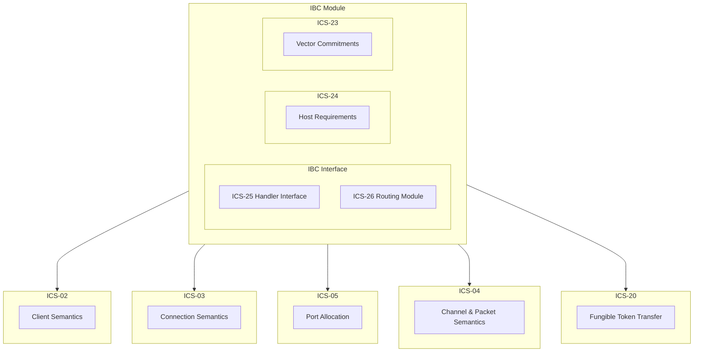

# **ICS-24** (Host Requirements) <!-- omit in toc -->

**NOTE**: This document is still a work in progress and as such may change over time, as and when any issues are identified.

- [Overview](#overview)
- [Module Structure](#module-structure)
- [Paths, Identifiers and Separators](#paths-identifiers-and-separators)
  - [Identifiers](#identifiers)
    - [Lengths](#lengths)
  - [Paths](#paths)
  - [Separators](#separators)
- [Key-Value Store](#key-value-store)
  - [Provable Store](#provable-store)
  - [Private Store](#private-store)
  - [Backend Store](#backend-store)
    - [Consensus State](#consensus-state)
  - [Current Implementations](#current-implementations)
- [Path Space](#path-space)
- [Host Requirements](#host-requirements)
  - [Consensus State Introspection](#consensus-state-introspection)
    - [State Storage](#state-storage)
  - [Client State Validation](#client-state-validation)
  - [Commitment Path Introspection](#commitment-path-introspection)
  - [Timestamp access](#timestamp-access)
  - [Port System](#port-system)
  - [Datagram Submission](#datagram-submission)
  - [Exception System](#exception-system)
  - [Event Logging System](#event-logging-system)
  - [Data Availability](#data-availability)
  - [Handling Upgrades](#handling-upgrades)
- [Implementation References](#implementation-references)
- [References](#references)

## Overview

ICS-24 [1] defines the interfaces, types and other requirements that the IBC module must expose to each of the sub-modules. This specification details the structures and patterns that must be implemented for the rest of the ICS core modules to be implemented successfully. Once this has been implemented the rest of the ICS core modules begin to be implemented in the correct order.

## Module Structure

The IBC module in V1 of the Pocket Network protocol must have a sub-module system, wherein each of the different aspects of the IBC module are implemented as sub-modules within the main IBC module. The specification details support for "untrusted" modules, however this is not necessary for our implementation. As we will be writing our modules ourselves, or vetting those that we decide to use (if any) we can follow the same pattern laid out in the implementation of `ibc-rs` [2] where they also do not support untrusted modules: but instead they assume all modules to be fully trusted.

In practice this will mean we have the following module structure:



## Paths, Identifiers and Separators

Paths, identifiers and separators are used to store, and retrieve and remove items from the key-value store defined below. They must follow certain rules.

### Identifiers

An `Identifier` is a bytestring used as the key for an object stored in the state, such as: a connection, a channel or a light-client.

Rules:

- They **must** be non-empty (of positive integer length)
- They must include only the following character sets
  - Alphanumeric
  - `.`, `_`, `+`, `-`, `#`
  - `[`, `]`, `<`, `>`

It is important to note that identifiers are not valuable and as such we should use a pseudo-random method to generate unique identifiers of constant length:

```go
const (
    identifierCharset = "abcdefghijklmnopqrstuvwxyzABCDEFGHIJKLMNOPQRSTUVWXYZ0123456789._+-#[]<>"
    identifierLength = 32
)

func stringWithCharset(length int, charset string) string {
    r := rand.New(rand.NewSource(time.Now().UnixNano()))
    b := make([]byte, length)
    for i := range b {
        b[i] = charset[r.Intn(len(charset))]
    }
    return string(b)
}

func NewIdentifier() string {
  return stringWithCharset(identifierLength, identifierCharset)
}

func ValidateIdentifier(identifier string) bool {
    if len(identifier) != identifierLength {
        return false
    }
    for _, c := range identifer {
        if ok := strings.Contains(identifer, string(c)); !ok {
            return false
        }
    }
    return true
}
```

#### Lengths

By default, identifiers have the following minimum and maximum lengths in characters:

| Port identifier | Client identifier | Connection identifier | Channel identifier |
| --------------- | ----------------- | --------------------- | ------------------ |
| 2 - 128         | 9 - 64            | 10 - 64               | 8 - 64             |

However, by using the code snippet above we would have the potential for `71P32` total unique identifier strings, or: `41694455590162700292588668110667281308822641049600000000`, which we are unlikely to ever use.

### Paths

A `Path` is a bytestring used as the key for an object stored in state and _must only contain_: identifiers, constant strings and the separator "`/`".

### Separators

The only valid separator for use in the IBC module key-value stores is a `/`. The separator is used to separate two identifiers or an identifier and a constant bytestring.

## Key-Value Store

The IBC module must maintain its own state, in order to do this it must have its own key-value store. This key-value store must be interacted through an interface with the following functions exposed:

```go
type Path []byte
type Value []byte

type Store interface {
    Get(path Path) (Value, error)
    Set(path Path, value Value) error
    Remove(path Path) error
}
```

_Note_: Here the value is defined as a byte slice, the actual encoding of the data depends on where it is coming from but will typically be a serialised protobuf or some other data structure.

This IBC module **must** provide 2 separate instances of this interface: `provableStore` and `privateStore`. The `provableStore` is storage read (proven) by external chains, whereas the `privateStore` is local to the host machine and is not to be read by external parties.

### Provable Store

- In the provable store the underlying key-value store of the `Store` interface **must** be able to be externally verifiable in accordance with `ICS-23`
- In the provable store all values in the store **must** use canonically encoded data structures in accordance with the various ICS specifications (serialised protobufs)

### Private Store

- In the provable store the underlying key-value store of the `Store` interface **may** be able to be externally verifiable in accordance with `ICS-23` but this is not required
- In the provable store all values in the store **may** use canonically encoded data structures in accordance with the various ICS specifications (serialised protobufs) but this is not required

### Backend Store

For the purposes of the Pocket Implementation of ICS-24, we should implement a single `Store` interface. This should utilise the `pokt-network/smt` package as its backend storage. This will allow for the generation of proofs for the `provableStore` paths and for the `privateStore` paths alike. Behind the SMT there will be 2 KVStores, one for nodes another for values. This allows for the key/value pairs to be inserted with the following function:

```go
func (*SMT) Update(key, value []byte) (root []byte, err error)
```

#### Consensus State

For the other stores the SMT with the node and value KVStores will work perfectly fine, and the proofs will be easily generated for a given path. However, the `consensusStates` entry in the tree must contain the information of the 7 SMTs that make up the state as defined in `persistence/state.go`. In order to better store this data some potential routes are explored below:

1. Export state and rebuild the trees:
   - Move the definitions of the order of the consensus state merkle trees (account, pools, transactions, etc.) into a protobuf enum in the shared directory.
   - Expose a function that allows for the current state to be exported in a standardised format (JSON, KVStores, Protobuf) that can be serialised into a `[]byte`
   - Expose a function that can hydrate this serialised `[]byte` back into the exported format and utilise the tree enum to rebuild the trees individually and recreate the 7 subtrees to create a proof as and when this is needed

### Current Implementations

Currently the `cosmos/ibc-go` package implements the stores using an IAVL backed by a KVStore such as `GoLevelDB` [3][4]. This is in a similar manner to what is proposed above. Essentially they have an struct `Store` that is initialised by each of the different stores required by IBC.

For Pocket however, we should implment the `Store` interface which is implemented by a struct containing an `*smt.SparseMerkleTree` this would allow us to leverage the SMT to do a lot of the work without much oversight.Specifically this will simply mean utilising `pokt-network/smt` and the `kvstore.KVStore` type as the underlying KVStores to support the SMT. The implementation of this `Store` interface could follow along the lines of the code below:

```go
const (
    treeStoreDir = "/var/trees"
)

var _ Store = &SMTStore{}

type Store interface {
    Get(path []byte) ([]byte, error)
    Set(path, value []byte) error
    Remove(path []byte) error
    GetRoot() []byte
    ...
}

type SMTStore struct {
    tree *smt.SparseMerkleTree
}

func NewStore(prefix string) (*SMTStore, error) {
    nodeStore, err := kvstore.NewKVStore(fmt.Sprintf("%s/%s_nodes", treesStoreDir, prefix)
	if err != nil {
		return nil, err
	}
    valuesStore, err := kvstore.NewKVStore(fmt.Sprintf("%s/%s_values", treesStoreDir, prefix)
	if err != nil {
		return nil, err
	}

    tree := smt.NewSparseMerkleTree(store.nodes, store.value, sha256.New())

    return &Store{
        tree,
    }
}

func (s *SMTStore) Get(path []byte) ([]byte, error) {
    return s.tree.Get(path)
}

func (s *SMTStore) Set(path, value []byte) error {
    _, err := s.tree.Update(key, value)
    return err
}

func (s *SMTStore) Remove(path []byte) error {
    _, err := s.tree.Delete(path)
    return err
}

func (s *SMTStore) GetRoot() []byte {
    return s.tree.Root()
}
...
```

In regards to the `ConsensusStore` this will be more challenging. Most likely we will use a separate struct to implement the `Store` interface for this store specifically, due it containing multiple KVStores behind it. One method to achieve this, as defined above, is by utilising the exported trees as the values for each height in the `ConsensusStore`, and implementing custom logic to implement the `GetRoot()` function as well as for generating proofs that hydrates the sub trees and performs any required actions on them as is appropriate.

## Path Space

The ICS-24 specification documents the following paths, their types and where they are used in the IBC module:

| Store         | Path format                                                                 | Value type     | Defined in |
| ------------- | --------------------------------------------------------------------------- | -------------- | ---------- |
| provableStore | "clients/{identifier}/clientState"                                          | ClientState    | ICS 2      |
| provableStore | "clients/{identifier}/consensusStates/{height}"                             | ConsensusState | ICS 2      |
| privateStore  | "clients/{identifier}/connections                                           | []Identifier   | ICS 3      |
| provableStore | "connections/{identifier}"                                                  | ConnectionEnd  | ICS 3      |
| privateStore  | "ports/{identifier}"                                                        | CapabilityKey  | ICS 5      |
| provableStore | "channelEnds/ports/{identifier}/channels/{identifier}"                      | ChannelEnd     | ICS 4      |
| provableStore | "nextSequenceSend/ports/{identifier}/channels/{identifier}"                 | uint64         | ICS 4      |
| provableStore | "nextSequenceRecv/ports/{identifier}/channels/{identifier}"                 | uint64         | ICS 4      |
| provableStore | "nextSequenceAck/ports/{identifier}/channels/{identifier}"                  | uint64         | ICS 4      |
| provableStore | "commitments/ports/{identifier}/channels/{identifier}/sequences/{sequence}" | bytes          | ICS 4      |
| provableStore | "receipts/ports/{identifier}/channels/{identifier}/sequences/{sequence}"    | bytes          | ICS 4      |
| provableStore | "acks/ports/{identifier}/channels/{identifier}/sequences/{sequence}"        | bytes          | ICS 4      |

Paths in the `provableStore` **must** be reserved for the IBC module's handler interface. In the event where new paths are added to the IBC spec they cannot be used by any other module. For the `privateStore` the paths can be used by other modules. However, to aid in simplicity as the `privateStore` refers to IBC related data, it would best be combined into a single IBC store interface that doesn't distinguish between private and provable.

This allows for the paths to remain open for additions when/if they come from the IBC specification as it changes over time, but also allows for a more simplistic implementation as we can treat all the different stores as part of a single store related to the IBC module of the Pocket Network.

## Host Requirements

With all of the types and structures defined, the host (the Pocket Network IBC module) must provide certain access/introspections into the different stores and states. The following section details the functions that **must** be exposed by the host machine.

### Consensus State Introspection

The following types must be defined in line with the [ICS-02 specification](../ics02/ics02.md)

```go
type ConsensusState interface
```

This interface **must** be serialisable and as such should be defined as a protobuf for transmission in its serialised form.

Along with this the following functions must be exposed

```go
func getCurrentHeight() uint64
func getConsensusState(height uint64) ConsensusState
func getStoredRecentConsensusStateCount() uint64
```

The host machine does not have to store the entirety of the consensus state history, but instead can store the latest `n` states. This is what is returned by `getStoredRecentConsensusStateCount()` after `n` states have been stored any new states added can prune the older ones, maintaining a constant store size of `consensusState` objects.

#### State Storage

We must maintain a reference to the latest `n` versions of the consensus state trees at any given time. However `n` is

### Client State Validation

The following types must be defined in line with the [ICS-02 specification](../ics02/ics02.md)

```go
type ClientState interface
```

This interface **must** be serialisable and as such should be defined as a protobuf for transmission in its serialised form.

The following functions must also be exposed

```go
func getHostClientState(height uint64) ClientState
func validateSelfClient(counterPartyClient ClientState) bool
```

The `validateSelfClient()` function takes the `ClientState` object from a light client ran on another chain and performs some basic validation against the client state of the host machine. An implementation of this can be seen in the tendermint client implementation of ICS-07 [5][6]

### Commitment Path Introspection

The host machine must expose the following function that returns a **constant** value:

```go
func getCommitmentPrefix() CommitmentPrefix
```

The `CommitmentPrefix` is used in conjunction with the `CommitmentRoot` and `CommitmentState` objects and must satisfy the following flow:

```go
if provableStore.get(path) === value {
    prefixedPath = applyPrefix(getCommitmentPrefix(), path)
    if value != nil {
        proof = createMembershipProof(state, prefixedPath, value)
        if ok := verifyMembership(root, proof, prefixedPath, value); !ok {
            panic("membership proof is not valid")
        }
    } else {
        proof = createNonMembershipProof(state, prefixedPath)
        if ok := verifyNonMembership(root, proof, prefixedPath); !ok {
            panic("non-membership proof is not valid")
        }
    }
}
```

### Timestamp access

The host machine must expose the following function to provide the current UNIX timestamp

```go
func currentTimestamp() uint64
```

Timeouts in headers must be non-decreasing this is used as a check for timeouts to be put in place.

### Port System

Ports are defined as `Identifier` bytestrings. The IBC handler interface must allow for IBC sub-modules to bind to unique ports with the following constraints:

- Once a port is bound to a sub-module, it must not be able to be used by another. Only once this port is released can it be used again
- A single IBC sub-module can bind to many ports
- Ports are allocated on a "first come, first served" basis. As such any "reserved" ports must be allocated at startup.

The IBC handler interface must implement these rules as outlines in [ICS-05](../../phase2/ics05/ics05.md)

### Datagram Submission

Datagrams are sent by IBC relayers to the IBC module's routing interface as defined in ICS-26 [7]. These allow for the relayer to only ever send their packets to the IBC module and it will determine what sub-module these need to be routed to. In order for this to function the host machine must expose the following function

```go
func submitDatagram(datagram Datagram)
```

In order to this to function correctly, the host machine must define the requirements needed to submit `Datagram` objects to the host machine. This may include any transaction fees, account and signature requirements that the relayer must provide; this stops any tampering or illegitimate transactions to be submitted on chain.

### Exception System

The IBC host machine **must** support an exception system whereby a transaction can be aborted and any state changes can be reversed (excluding any fees paid), and any system invariant violation can halt the state machine. This requires the following functions:

```go
func abortTransaction(abort bool)
func abortSystemUnless(abort bool)
```

In both functions if the `abort` parameter is `false` then nothing should happen. However, if it is `true` then the `abortTransaction()` function **must** abort the transaction taking place and revert any state changes (excluding fees) and the `abortSystemUnless()` function **must** cause the state machine to halt.

This can be achieved through the use of savepoints in the Pocket Network, in reality we should not allow any transactions to be committed if they do not meet the previously defined requirements. In the case where they fail to meet these conditions they should not be allowed to be processed, and this error should be returned to the relayers.

### Event Logging System

The host machine must expose an event logging system such that arbitrary data can be stored, indexed and queried outside of the state vector. These event logs are used by the IBC relayers to read IBC packet data and timeouts, they are not stored directly on chain, but instead are committed to with a succinct cryptographic commitment, which is what gets stored.

The following functions must be exposed:

```go
func emitLogEntry(topic string, data []byte)
func queryByTopic(height uint64, topic string) [][]byte
```

In order to improve the efficiency of the relayers, multiple functions for the storing and querying of event data can be implemented but this is **not** required, and is only an optimisation.

### Data Availability

The host machine **must** following the following principals in order to achieve the desired data availability requirements:

- Deliver-or-Timeout safety
  - Host machines **must** have _eventual data availability_ such that any key/value pair in the state can be eventually retrieved by the relayers
  - For exactly-once safety this is not a requirement
- Liveness of packet relay
  - Host machines must have _bounded transactional liveness_ (and thus consensus liveness) such that incoming transactions are confirmed within a block height bound (less than the timeout assigned to packets)
- Data relied upon by relayers
  - IBC packet data and other data not stored in the state vector **must** be available to **and** efficiently computed by relayer processes

Light clients **may** have more strict data availability requirements

### Handling Upgrades

The IBC module is able to be updated as long as the following conditions are met:

- All IBC handler logic **must** remain compliant with the IBC specification between upgrades
- All IBC state (`provableStore` and `privateStore`) **must** remain persistent between upgrades
- Any light client algorithm changes **must** be announced to any light clients running on counterparty chains **prior** to the implementation of such changes
  - This enables them to upgrade safely and switch atomically, preserving the continuity of connections and channels

## Implementation References

The implementation of IBC-24 has many different facets to it. The path system can reference the `cosmos/ibc-go` implementation [8]. The other elements such as the stores can also reference the `cosmos/ibc-go` implementation but is more likely to differ in all but the high level concepts. As the later ICS components are implemented (ICS-02, ICS-03, ICS-05, ICS-04) the details around how ICS-24 will be used will become more clear and the implementation will become more Pocket specific.

## References

[1] https://github.com/cosmos/ibc/tree/main/spec/core/ics-024-host-requirements

[2] https://github.com/cosmos/ibc-rs/tree/main/crates/ibc#module-system-no-support-for-untrusted-modules

[3] https://github.com/cosmos/cosmos-sdk/blob/main/store/rootmulti/store.go

[4] https://github.com/cosmos/cosmos-db

[5] https://github.com/cosmos/ibc/tree/main/spec/core/ics-024-host-requirements#client-state-validation

[6] https://github.com/cosmos/ibc/tree/main/spec/client/ics-007-tendermint-client

[7] https://github.com/cosmos/ibc/tree/main/spec/core/ics-026-routing-module

[8] https://github.com/cosmos/ibc-go/tree/main/modules/core/24-host
